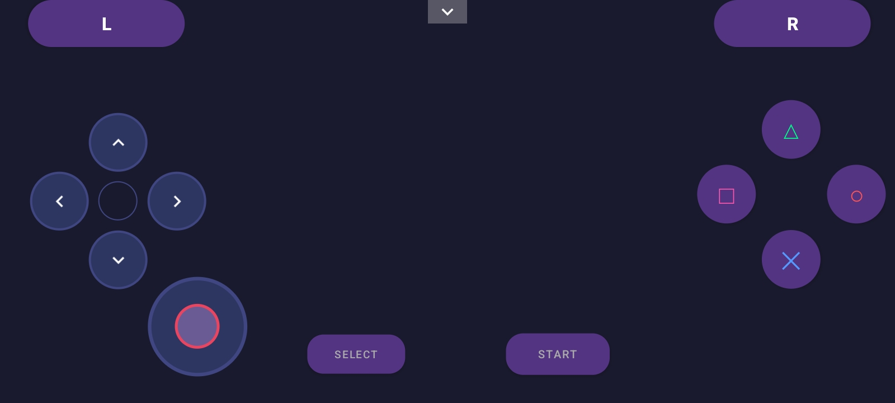
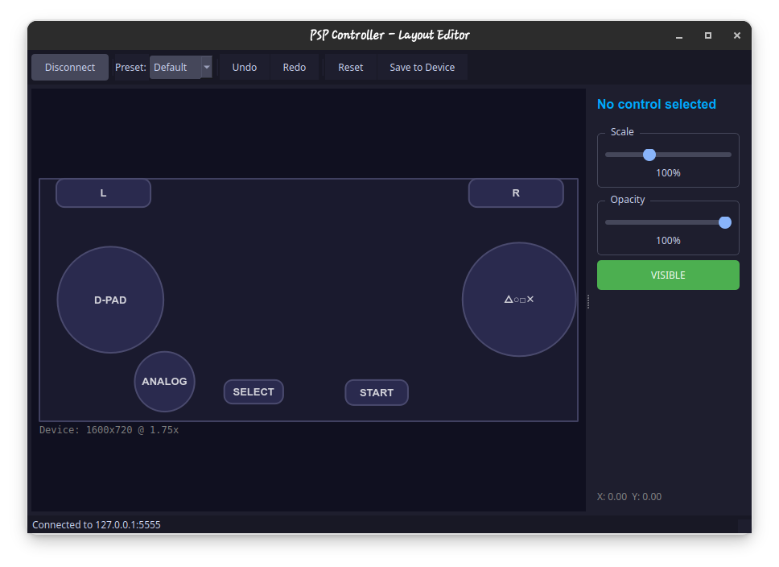

# PSP Linux Controller

Use your Android phone as a wireless PSP controller for PPSSPP emulator on Linux.




## What It Does

This app lets you control PPSSPP running on your Linux PC using your phone as a gamepad. It connects over WiFi with very low latency (typically 1-5ms on a local network).

The controller has all the PSP buttons - D-pad, analog stick, action buttons (Triangle, Circle, Square, Cross), shoulders (L/R), and Start/Select.

There's also a desktop layout editor that lets you drag buttons around and see the changes live on your phone. Much easier than fiddling with the phone screen.

## Getting Started

### Step 1: Download

Grab the latest release from the [Releases page](../../releases):

- **PSPLinuxController-x.x.x.apk** - Install this on your Android phone
- **PSPLinuxController-Server-x.x.x.tar.gz** - Extract this on your Linux PC

### Step 2: Set Up the Server

Extract the server tarball somewhere convenient:

```bash
tar -xzf PSPLinuxController-Server-*.tar.gz
cd PSPLinuxController-Server
```

Install xdotool if you don't have it (the server uses this to simulate keyboard input):

```bash
sudo apt install xdotool
```

Install additional dependencies for QR code functionality:

```bash
pip install qrcode[pil]
```

Start the server:

```bash
./start_server.sh
```

You'll see something like this:

```
==================================================
  PSP Controller Server
  Made by Uzair
==================================================
  Local IP:  192.168.1.100
  Port:      5555
==================================================

Press 'F' to toggle QR code display
```

Note down that IP address - you'll need it for the phone app.

### Step 3: Install the App

Transfer the APK to your phone and install it. You might need to allow installing from unknown sources in your phone's settings.

### Step 4: Connect and Play

#### Option A: Manual Connection
1. Open the app on your phone
2. Tap the Connect button and enter your PC's IP address
3. Launch PPSSPP on your PC and load a game
4. Use your phone as the controller!

#### Option B: QR Code Connection
1. On your PC, press 'F' in the server terminal to display the QR code
2. Open the app on your phone
3. Tap the Connect button, then tap "Scan QR Code"
4. Point your phone's camera at the QR code displayed on your PC
5. Launch PPSSPP on your PC and load a game
6. Use your phone as the controller!

## Customizing the Layout

If you want to move buttons around, use the desktop layout editor:

```bash
pip install PyQt5  # Only needed once
python3 layout_editor_gui.py
```

Drag controls to reposition them. Changes show up on your phone in real-time. Hit Save when you're happy with the layout.

The editor supports undo/redo with Ctrl+Z and Ctrl+Y.

## Game Streaming

Stream the PPSSPP window to your phone as a live background behind the controller buttons!

### Setup

Install streaming dependencies:

```bash
sudo apt install python3-gi gir1.2-gst-1.0 gstreamer1.0-pipewire
pip install Pillow  # Optional fallback
```

### Usage

1. Start PPSSPP on your PC
2. **Resize PPSSPP window** to match your phone's aspect ratio for best results
3. Start the server and connect your phone
4. Open **Settings** → Enable **"Game Stream"**
5. **A system dialog will appear** - select the PPSSPP window to share
6. The game appears as your controller background!

> **Tip:** For the best experience, resize the PPSSPP window on your PC so it matches your phone's screen proportions. The stream will scale to fill your phone's display.

> **Note:** On Wayland (GNOME/KDE), the system asks permission to share your screen. Buttons become semi-transparent while streaming.

**Technical Deep Dive:** [How We Made Wayland Screen Streaming Work](docs/WAYLAND_STREAMING.md) - Learn about the challenges of Wayland screen capture and how we solved it using XDG Desktop Portal + PipeWire.

## Default Key Bindings

These are the keyboard keys that get pressed when you tap each button:

| Button | Key |
|--------|-----|
| D-pad | Arrow Keys |
| Cross | Z |
| Circle | X |
| Square | A |
| Triangle | S |
| Start | Space |
| Select | V |
| L / R | Q / W |
| Analog | I/J/K/L |

You can change these in PPSSPP's control settings if needed.

## Troubleshooting

**Can't connect?**

Make sure your phone and PC are on the same WiFi network. You might also need to allow port 5555 through your firewall:

```bash
sudo ufw allow 5555
```

**Button presses not working?**

Make sure PPSSPP has focus (click on it). You can test if xdotool is working by running:

```bash
xdotool key z
```

## Building From Source

If you want to build the app yourself instead of using the releases:

```bash
# Build the APK
./gradlew assembleDebug
adb install app/build/outputs/apk/debug/app-debug.apk

# Run the server (no build needed, it's Python)
cd server
./start_server.sh
```

## License

Apache License 2.0

---

## Contributing

Contributions are welcome! Please open an issue or submit a pull request.

---

Made by Uzair
